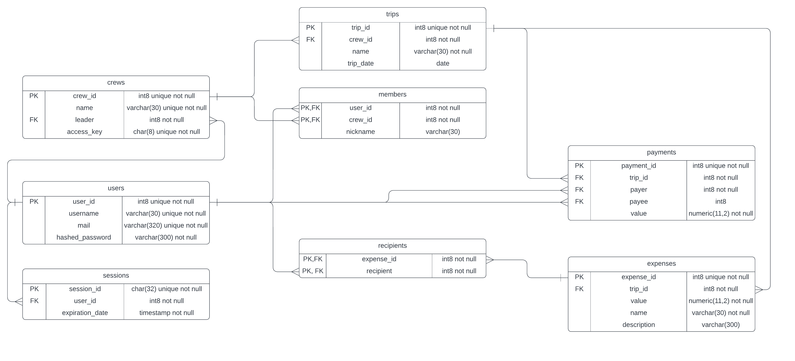

# Project "ExpensesManager" in early development phase
## Concept
Web page that will help group of friends to manage expenses during their trips. User can create/join many crews, crews can have multiple trips.
## Tech stack
* Java Spring Boot
* Docker
* Postgres
## Objectives
* Create working backend with skills gained during university projects 
* Create optimal database with knowledge and skills gained during university projects and database course
* Learn frontend and create working frontend
## Current work
##### Done:
* ER diagram
* Database
* Docker setup
* Model entities
* Endpoints related to users, crews
* A lot of services
##### TODO:
* reasonable exceptions
* reasonable Dtos
* more endpoints
* expense calculation logic
## ER diagram

## Database creation script
```postgresql
create table users(
	user_id int8 not null,
	username varchar(30) unique not null,
	mail varchar(320) unique not null,
	hashed_password varchar(300) not null,
	primary key (user_id)
);

create table crews(
	crew_id int8 not null,
	name varchar(30) unique not null,
	leader int8 not null,
	access_key char(8) unique not null,
	primary key (crew_id),
	foreign key (leader) references users(user_id)
);

create table trips(
	trip_id int8 not null,
	crew_id int8 not null,
	name varchar(30) not null,
	trip_date date,
	primary key (trip_id),
	foreign key (crew_id) references crews(crew_id)
);

create table members(
	user_id int8 not null,
	crew_id int8 not null,
	nickname varchar(30),
	primary key(user_id,crew_id),
	foreign key(user_id) references users(user_id),
	foreign key(crew_id) references crews(crew_id)
);

create table payments(
	payment_id int8 not null,
	trip_id int8 not null,
	payer int8 not null,
	payee int8,
	value numeric(11,2) not null,
	check (payer <> payee),	
	primary key (payment_id),
	foreign key (trip_id) references trips(trip_id),
	foreign key (payer) references users(user_id),
    	foreign key (payee) references users(user_id)
);

create table expenses(
	expense_id int8 not null,
	trip_id int8 not null,
	value numeric(11,2) not null,
    name varchar(30) not null,
    description varchar(300),
	primary key (expense_id),
	foreign key (trip_id) references trips(trip_id)
);

create table recipients(
	expense_id int8 not null,
	recipient int8 not null,
	primary key (expense_id, recipient),
	foreign key (expense_id) references expenses(expense_id),
	foreign key (recipient) references users(user_id)
);

create table sessions(
    session_id char(32) not null,
    user_id int8 not null,
    expiration_date timestamp not null,
    primary key (session_id),
    foreign key (user_id) references users(user_id)
);
```